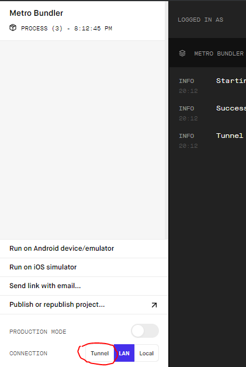

# Car Park Finder app

Tools used:

1. Expo
2. React Native
3. NodeJS
4. MongoDB Stitch
5. MongoDB Atlas
6. DotEnv

Main libraries used:

1. axios
2. react-native-maps
3. react-native-map-directions
4. react-native-paper
5. react-navigation
6. rn-bottom-drawer

## Installation:

#### Download NodeJS if not installed

[NodeJS Homepage](https://nodejs.org/)

#### Install related packages for the project

```
npm install
```

#### Install Expo

```
npm install -g expo-cli
```

#### Create a Environment Variable file using .env_sample

Attached to this project is a _.env_sample_ file.

Replace the contents with the desired values:

```
APP_ID= ADD APP ID HERE
STITCH_SERVICE_NAME= ADD STITCH SERVICE NAME HERE
DB_NAME= ADD DATABASE NAME HERE
COLLECTION_NAME= ADD COLLECTION NAME HERE
```

Rename the sample file to _.env_ afterwards

#### Launch Expo client in terminal

```
expo start
```

Devtool webpage will pop up in browser. Select your choice for displaying the app.

#### NOTE:

Select tunnel if scanning QR Code. High chance of not getting connection issues.



#### Disclaimer:

Best practices of React Native was not used properly in this project. It would definitely be better if there was more time given
